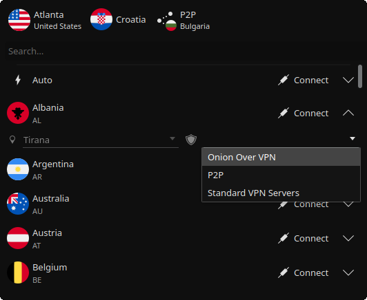

# NordVPN Plasmoid

Simple GUI for the official [NordVPN linux client](https://nordvpn.com/download/linux/). It allows to quick connect and select servers including cities and special servers. Connections can be saved as favorite to skip looking for frequently used servers.



## Features

* Connection status information as the icon's color, country indicator and a tooltip
* Quick connect/disconnect by middle click on the icon
* Adding servers to favorites

## Requirements

* [NordVPN linux client](https://nordvpn.com/download/linux/)
* Qt >= 5.14, KDE Frameworks >= 5.73, KDE Plasma >= 5.19 (Kubuntu 20.10 and newer)

## Installation

The preferred and easiest way to install is to use Plasma Discover or KDE Get New Stuff and search for *NordVPN Plasmoid*.

### From file

Download the latest version of plasmoid from [KDE Store](https://store.kde.org/p/1689651/) or [release page](https://github.com/korapp/plasma-nordvpn/releases)

#### A) Plasma UI

1. Right click on panel or desktop
2. Select *Add Widgets > Get New Widgets > Install From Local File*
3. Choose downloaded plasmoid file

#### B) Terminal

```sh
plasmapkg2 -i plasma-nordvpn-*.plasmoid
```

### From GitHub

Clone repository and go to the project directory

```sh
git clone https://github.com/korapp/plasma-nordvpn.git
cd plasma-nordvpn
```

#### A) Plasma Packaging

```sh
plasmapkg2 -i plasmoid
```

#### B) CMake

```sh
cmake .
make install
```

## Support

Say thank you with coffee ☕ if you'd like.

[](https://liberapay.com/korapp/donate)
[](https://ko-fi.com/korapp)
[](https://revolut.me/korapp)

[kdestore]: https://store.kde.org/p/1689651/
[download]: https://github.com/korapp/plasma-nordvpn/releases
[nordvpn]: https://nordvpn.com/download/linux
