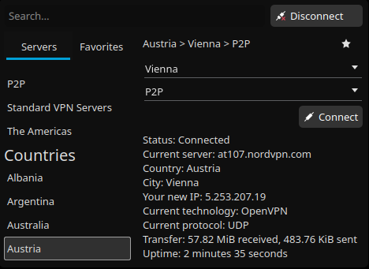

# NordVPN Plasmoid

The plasmoid is a simple GUI for official [NordVPN linux client](https://nordvpn.com/download/linux/). It allows to quick connect and select servers including cities and special servers. Any connection can be saved as favorite to skip looking for frequently used servers.



## Installation

Run `install.sh` or plasma installer directly

```bash
kpackagetool5 --type Plasma/Applet --install plasmoid
```
